# Linux Essentials for DevOps Engineers

---

## What is Linux and Why It’s Widely Used as Application Server?

* **Unix:** Paid OS (like macOS)
* **Linux:** Open source, free (GPL license)
* **Windows:** Commercial license

---

## Linux Architecture

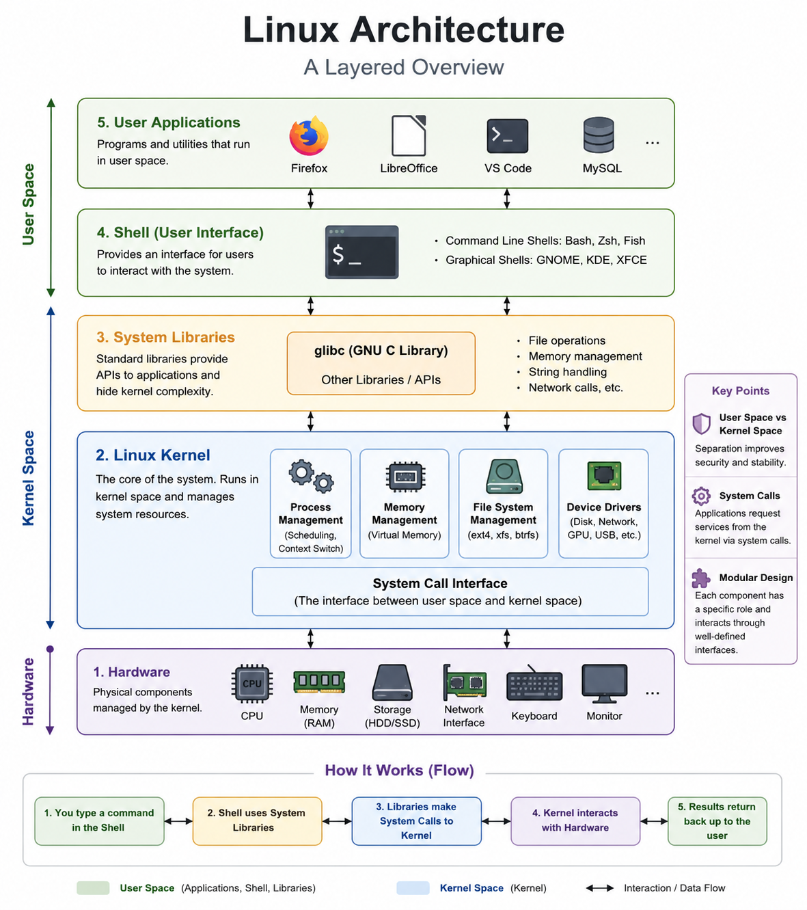

**What happens when system boots?**
```text
Power On
→ BIOS/UEFI
→ Bootloader (GRUB)
→ Kernel + initramfs
→ Root filesystem mounted
→ systemd (PID 1)
→ Services start
→ Login / Application ready
```
On boot, firmware initializes hardware and loads GRUB. GRUB loads the Linux kernel and initramfs. The kernel initializes memory, CPU, drivers, mounts the root filesystem, then starts PID 1, usually systemd. systemd then starts required targets and services like networking, SSH, logging, Docker, and application services until the system reaches operational state.

---

## Accessing Remote Machines

| Protocol | Port | Purpose                 |
| -------- | ---- | ----------------------- |
| RDP      | 3389 | Remote Desktop Protocol |
| SSH      | 22   | Secure Shell            |
- Previously authentication was done using username and password but more secure way is to use ssh-key-pair => (Public key + Private key) 
- When we create linux server let's say EC2, then we will put public key inside the server (acts as public lock) and we keep private key with us (acts as key to public lock). Public key is added inside `~/.ssh/authorized_keys`. 
- Now, when we want to login using ssh, we need to provide private key to access the machine.

### Accessing machine with specific user -
> Scenario - Let's say we have 2 machines - VM1 and VM2. We want to access VM2 using user1 from VM1. (provided that the same user present in both machines.)
```bash
# login with user1 on VM1 and create key pairs
ssh-keygen -t rsa -b 4096 -C "abhishek"  # this will create 2 files in ~/.ssh folder. one is public key (.pub) and one is private key

ls ~/.ssh

# now copy the content of public key and paste it inside VM2.
# login with user1 on VM2 
cd ~/.ssh

vim authorized_keys   # paste the VM1 user1's public key content here.

# Now if we try to ssh with user1 from VM1 to VM2 -> we can login without password.
ssh user1@<public_ip_VM2>

```


## Ports 
In Linux, a port is a logical communication endpoint used by applications and services to send/receive network data.

Think of it like this:  
- IP Address = Apartment building address
- Port Number = Specific apartment number
- Application/Service = Person inside the apartment

A port is a 16-bit number:  

Range: 0 → 65535

Example:  
192.168.1.10:80  
192.168.1.10 = IP  
80 = Port

- Multiple applications run on the same Linux machine: SSH server
Web server
Database
Kubernetes
Jenkins etc.

- Ports allow Linux to distinguish between them.
- Without ports, Linux wouldn’t know:  
whether incoming traffic is for SSH,
Apache,
MySQL,
or Docker.

Port ranges -
| Range       | Type              | Usage                  |
| ----------- | ----------------- | ---------------------- |
| 0–1023      | Well-known ports  | System services        |
| 1024–49151  | Registered ports  | Applications           |
| 49152–65535 | Ephemeral/Dynamic | Temporary client ports |

Common Linux Ports - 
| Port | Protocol | Service               |
| ---- | -------- | --------------------- |
| 22   | TCP      | SSH                   |
| 80   | TCP      | HTTP                  |
| 443  | TCP      | HTTPS                 |
| 3306 | TCP      | MySQL                 |
| 5432 | TCP      | PostgreSQL            |
| 6379 | TCP      | Redis                 |
| 8080 | TCP      | Tomcat/Spring Boot    |
| 9090 | TCP      | Prometheus            |
| 6443 | TCP      | Kubernetes API Server |


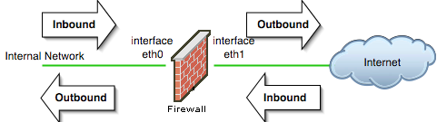

So when data reaches a server, the port number tells Linux which application should receive it.

Check Open Ports in Linux -   
`ss -tulnp`  
`netstat -tulnp`  
`lsof -i :8080` -> Shows process using port 8080.

### Open a Port in Linux

* Depends on firewall:

  * `ufw` (Ubuntu)
  * `firewalld` (RHEL/CentOS/Fedora)
  * `iptables` (older/manual)

```bash
sudo ufw allow 8080/tcp
sudo firewall-cmd --permanent --add-port=8080/tcp
sudo firewall-cmd --list-ports
iptables -A INPUT -p tcp --dport 8080 -j ACCEPT
```


## Linux File System Overview

| Directory | Description                                |
| --------- | ------------------------------------------ |
| /         | Root directory                             |
| /bin      | Essential command binaries (ls, cp)        |
| /boot     | Bootloader files (Linux kernel)            |
| /dev      | Device files (hard drives, USBs)           |
| /etc      | System configuration files                 |
| /home     | User home directories                      |
| /lib      | Shared libraries for binaries              |
| /media    | Mount point for external devices           |
| /mnt      | Temporary mount point                      |
| /opt      | Optional software packages                 |
| /proc     | Virtual filesystem for process/system info |
| /root     | Root user home directory                   |
| /sbin     | System binaries for admin                  |
| /tmp      | Temporary files (deleted on reboot)        |
| /usr      | Secondary hierarchy for user apps          |
| /var      | Variable data (logs, mail, databases)      |


## User Management
- One of the useful feature of linux is multiple users can work simultaneously on the same machine.
- There are basically 2 types of users -> root user and non-root users.
- Each user can have their own public-private key pairs.

### User CRUD operations -

```bash
sudo adduser username   # Interactive (user friendly)
```

```bash
sudo useradd username  # Non-interactive
sudo passwd username
```

> Task - Create user1 and user2 using useradd and adduser command each. Ensure users are added in the system. Check the differences in defaults between user created using useradd vs adduser. Change/set the password for one of the user. 


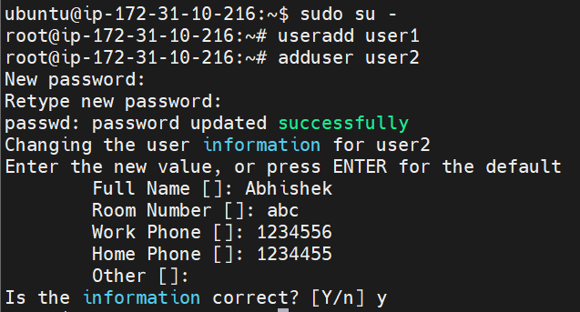
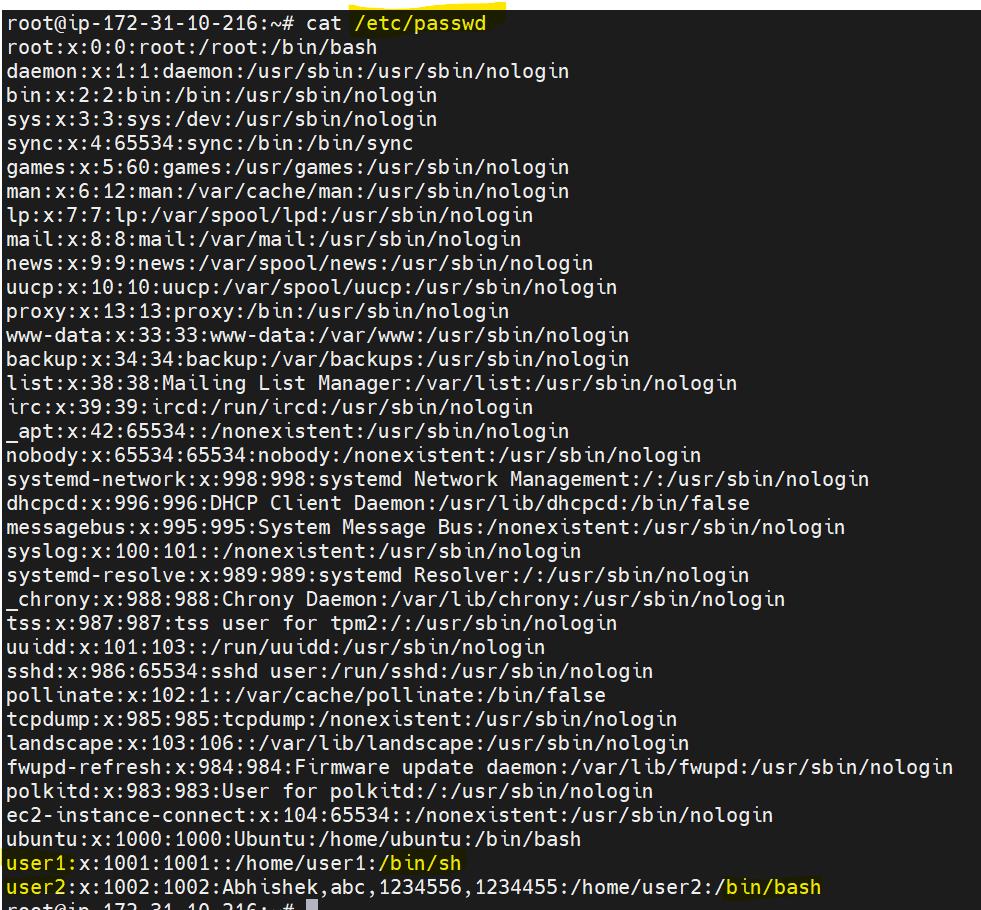

**Fields:**

1. username: Login name
2. x: Placeholder for password (real password in /etc/shadow)
3. UID: User ID (0=root)
4. GID: Primary group ID
5. comment: Full name/description (optional)
6. home_directory: Path to home folder
7. shell: Default shell (e.g., /bin/bash)

Note: Always use `adduser` command as it is interactive.

When we run `adduser` command -
- It creates user. (user2)
- It creates user's home directory.  (/home/user2)
- It created group with name same as username. (user2)

**Change user's password:**
```bash
sudo passwd <username>
```

### Switch users
```bash
su - <username>   # switch to other user
whoami            # returns current username
```


### User Groups
- One user can be a part of multiple groups.
```bash
groups  # check the current user is part of which groups
addgroup <group_name>  # create a new group
usermod -aG <group_name> <username>   # add user to a group
usermod -aG <comma-separated-grou-names>  # add user to list of groups
cat /etc/group  # list all groups
```
- Let's create a new group g2 and make user2 part of g2  

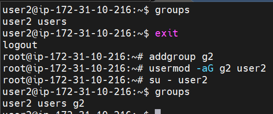

- `-aG` is used to append the new group. User is part of some group(s) and we want it to be a part of one more group. If we use `-g`, it will change primary group of the user. In above example, primary group for user2 is user2.

- Remove user from a group: 
```bash
gpasswd -d user2 g2
```

### Some more user operations:
- Force password change for first time login for a user:
```bash
passwd -e user1
```
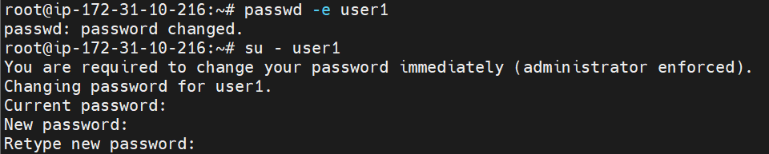

- Lock and unlock user:
```bash
usermod -L user2  # lock user's password authentication. Adds '!' infornt of the user's password in /etc/shadow
usermod -U user2 # unlock user's password authentication
```

- Delete a user:

```bash
sudo deluser username
```

- Delete user and home directory:

```bash
sudo deluser --remove-home username
```

- Modify user (change username):

```bash
sudo usermod -l newname oldname
```

- Change user’s home directory:

```bash
sudo usermod -d /new/home username
```

- Check if user exists:

```bash
id username
```

### What is `sudo`?

* **SuperUser DO**, allows running commands as root or another user. 
* Controlled via `/etc/sudoers` file. **Only those users which are part of `sudo` group can run `sudo` commands.**
* Use `visudo` to edit safely:

```bash
sudo visudo
```


## Linux File Permissions

**Each file/directory has permissions:** Who can read (r), write (w), execute (x)

**Permission format example:**

```
-rwxr-xr--
```

* 1st char: type (- = file, d = directory)
* Next 9 chars: permissions in 3 groups (owner, group, others)

**Letters Meaning:**

* r(4) = read
* w(2) = write
* x(1) = execute

| Permission    | File Meaning                           | Directory Meaning                                     |
| ------------- | -------------------------------------- | ----------------------------------------------------- |
| `r` (read)    | View file contents                     | List directory contents (`ls`)                        |
| `w` (write)   | Modify file contents                   | Create, delete, rename files inside directory         |
| `x` (execute) | Execute file/program/script            | Enter/access directory (`cd`) and access files inside |
| `rw-`         | Read and modify file                   | List contents and create/delete files                 |
| `r-x`         | Read and execute file                  | List contents and access files inside                 |


**Changing Permissions:**

```bash
# use below commands to change permission for single entity (either user or group or others).
chmod u+x file.txt   # add execute to owner
chmod g-w file.txt   # remove write from group
chmod o=r file.txt   # others read-only

# use below commands to change permissions for all three at once (user, group and others).
chmod 755            # common for scripts
chmod 644            # regular files
chmod 700            # private files

chmod -R 755 folder1/    # permission applies to directory as well as files inside the directory

chown user1 file.txt     # change owner of a file to user1.
chown :g1 file.txt       # change group of a file to g1.
chown user1:g1 file.txt  # change both owner and group of a file.
```

**Note:** Linux permissions are evaluated in order: owner → group → others. The system stops at the first match and does not combine permissions. If a user owns the file, only owner permissions apply, even if the user is also part of the file’s group.

## Special permissions
Normal permissions are:
```text
rwx   rwx   rwx
user group others
```

But Linux also has special permission bits:
1. SUID (Set User ID)  
- When an executable file has SUID, users running that file execute it with the owner’s privileges, not their own.
- Run `chmod +s file` and now if we check `ls -l file` we can see `-rwsr-xr-x`    
Notice `s` in owner execute field.  


2. SGID (Set Group ID)
- When set on an executable file, program runs with group privileges of file’s group.
- Run `chmod g+s file` we get -> `-rwxr-sr-x`
- When SGID is set on a directory, new files created inside inherit the directory’s group.

3. Sticky Bit
- If sticky bit is set on a writable shared directory, users can create files, but only the file owner, directory owner, or root can delete/rename them.
- Without sticky bit, anyone with write access to the directory could delete others’ files.
- Run `chmod +t /tmp` and we get -> `drwx-rwx-rwt`


### Umask

* **User File Creation Mask**, controls default permissions for new files/directories.
* Set permanently for a user: add to `~/.bashrc` or `~/.profile`

```bash
  umask 027
```

* System-wide: edit `/etc/profile` or `/etc/login.defs`
* Common values:

  * 002 → Files: 664, Dirs: 775 (shared groups)
  * 022 → Files: 644, Dirs: 755 (default)
  * 027 → Files: 640, Dirs: 750 (secure)


## Package management  

### What is a Package?
A package is a compressed bundle containing:
- application binaries
- libraries
- configuration files
- metadata
- dependency information

Examples:  
- nginx
- git
- docker


| Feature                          | Red Hat Enterprise Linux 8 | Ubuntu                  |
| -------------------------------- | -------------------------- | ----------------------- |
| Package Format                   | `.rpm`                     | `.deb`                  |
| High-Level Package Manager       | `dnf`                      | `apt`                   |
| Older Package Manager            | `yum`                      | `apt-get`               |
| Low-Level Package Tool           | `rpm`                      | `dpkg`                  |
| Repository Config Directory/File | `/etc/yum.repos.d/`        | `/etc/apt/sources.list` |
| Package Database Directory       | `/var/lib/rpm`             | `/var/lib/dpkg`         |
| Install Package                  | `dnf install nginx`        | `apt install nginx`     |
| Remove Package                   | `dnf remove nginx`         | `apt remove nginx`      |
| Update Package Metadata          | `dnf check-update`         | `apt update`            |
| Upgrade Installed Packages       | `dnf update`               | `apt upgrade`           |
| Search Package                   | `dnf search nginx`         | `apt search nginx`      |
| Package Information              | `dnf info nginx`           | `apt show nginx`        |
| List Installed Packages          | `dnf list installed`       | `apt list --installed`  |
| Install Local Package            | `rpm -ivh file.rpm`        | `dpkg -i file.deb`      |
| Check Installed Package          | `rpm -qa \| grep nginx`    | `dpkg -l \| grep nginx` |
| List Files Installed by Package  | `rpm -ql nginx`            | `dpkg -L nginx`         |


```bash
apt update      # Refresh package metadata
apt upgrade     # Actually upgrades installed packages

apt remove nginx  # removes application binaries but keep configuration files
apt purge nginx   # remove everything

```


## Process management
### Linux Process Concepts: Foreground vs Background, Zombie, Orphan, Process Lifecycle
Linux creates processes using `fork()`. Parent duplicates itself into child. Child usually runs `exec()` to load new program. Parent may call `wait()` to collect exit status.

- Foreground process = attached to terminal  (`ping google.com`)
- Background process = runs behind terminal  (`ping google.com &`)
- Zombie = 
  - A zombie process is a child process that has finished execution, but parent has not collected its exit status. It is dead, but still exists in process table.
  - Zombie process itself is already terminated. To remove zombie entry, parent must `wait()` or parent exits so init/systemd reaps it.
  - Killing parent process will kill zombie process (`kill -9 <parent_pid>`)
- Orphan =
  - An orphan process is a child process whose parent has terminated while child is still running.
  - Linux reassigns orphan to PID 1:
    - systemd
    - init
- Process Lifecycle (fork → exec → wait)
```text
Parent Shell
   |
 fork()
   |
Child Created
   |
 exec(ls)
   |
 ls runs
   |
 exits
   |
 parent wait()
````

```bash
# important commands
ps -ef   # list down all running processes
ps aux --sort=-%cpu   # list down processes with cpu usage (sorted order)
kill -15 <pid>   # graceful
kill -9 <pid>    # force
nice
renice

# different ps commands
ps      # see processes in current shell
ps -e   # see all processes system wide
ps aux  # see all processes with memory and cpu info
ps -ef  # see all processes with parent child info 

# working with jobs
ping google.com &   # returns [job number] and pid.
jobs    # to check running jobs.
fg %1   # bring job number 1 to foreground.
bg %1   # push the process to the background.
```

**Note:** Process priorities ranges from -20 (highest) to +19 (lowest) 

check more details about `nice` and `renice` here ->   
https://www.geeksforgeeks.org/linux-unix/nice-and-renice-command-in-linux-with-examples/

### Killing/interrupting  processes 
- `ctrl + c`         -> interrupt now
- `ctrl + z`         -> stop the process (can be started again)
- `kill -15 <pid>`   ->  graceful
- `kill -9 <pid>`    ->  force

 > Scenario  - Why is CPU 100%? How do you debug?  
 -> If CPU hits 100%, first I check whether it is actual CPU saturation using top/vmstat/mpstat(`mpstat -P ALL 1`). Then I identify which process is consuming CPU using `top` or `ps`. If it’s Java, I inspect threads using `top -H` and `jstack`. If containerized, I check `kubectl top pod` and logs. I also verify whether it is user CPU, system CPU, or I/O wait. Then I correlate with deployments, cron jobs, traffic spikes, or code regressions. Finally I mitigate by restarting, scaling, renicing, or rollbacking while doing RCA.


`wget` vs `curl` -

| Feature                 | `wget`                   | `curl`                       |
| ----------------------- | ------------------------ | ---------------------------- |
| Primary Use             | File downloading         | Data transfer/API requests   |
| Default Output          | Saves file automatically | Prints response to terminal  |
| Resume Downloads        | ✅ Easy (`-c`)            | ✅ Possible                   |
| Recursive Downloads     | ✅ Supported              | ❌ Not built-in               |
| API Testing             | Limited                  | Excellent                    |
| Supports Many Protocols | Moderate                 | Very extensive               |
| Upload Support          | Limited                  | Strong support               |
| REST API Calls          | Basic                    | Excellent                    |
| Installed by Default    | Common on servers        | Common on most systems       |
| Better for Automation   | Good for downloads       | Excellent for scripting/APIs |


## AWK Command - Powerful Text Processor

File content (file.txt) -
```text
101,John,DevOps,75000,Pune
102,Alice,Java,85000,Mumbai
103,Bob,Support,45000,Chennai
104,David,DevOps,92000,Bangalore
105,Eva,HR,50000,Delhi
106,Frank,Java,78000,Pune
107,Grace,Support,40000,Mumbai
108,Harry,DevOps,98000,Hyderabad
109,Ivy,Java,88000,Bangalore
110,Jack,HR,52000,Chennai
111,Karen,DevOps,120000,Mumbai
112,Leo,Support,47000,Pune
113,Mary,Java,91000,Delhi
114,Nina,HR,55000,Bangalore
115,Oscar,DevOps,87000,Chennai
116,Paul,Java,76000,Hyderabad
117,Queen,Support,43000,Delhi
118,Ryan,DevOps,95000,Pune
119,Sophia,Java,99000,Mumbai
120,Tom,HR,60000,Hyderabad
```

### Basic Syntax 

```bash
awk 'pattern {action}' filename
```

### Common Examples

1. Print entire file:

```bash
awk '{print}' file.txt
```

2. Print 1st column:

```bash
awk -F ',' '{print $1}' file.txt
```

3. Print 1st and 3rd column:

```bash
awk -F ',' '{print $1, $3}' file.txt
```

4. Use conditions:

```bash
awk -F ',' '$4 > 70000' file.txt  # print entire row. We can use '{print $0}' also to print entire row.
# or
awk -F ',' '$4 > 70000 {print $2}'  # print only second row for matching condition.  
```

5. Pattern match (like grep):

```bash
awk -F ',' '/DevOps/'  file.txt
```


## GREP Command - Search Text

### Basic Syntax

```bash
grep [options] pattern filename
```

### Common Examples

1. Find lines containing "error":

```bash
grep "error" file.txt
```

2. Case-insensitive search:

```bash
grep -i "error" file.txt
```

3. Show line numbers:

```bash
grep -n "error" file.txt
```

4. Show lines NOT matching:

```bash
grep -v "error" file.txt
```

5. Count matching lines 
```bash
grep -i  -c devops file.txt
```

6. Search recursively in directory:

```bash
grep -r "keyword" /path/to/dir
grep -r -i devops /root/
grep -r -i devops /root/devops/*txt
grep -r -i devops .
```

7. Use regex (lines starting with "a"):

```bash
grep '^a' file.txt       # lines starting with "a"
grep 'Mumbai$' file.txt  # lines ending with "Mumbai"
```

8. Search multiple patterns with OR -
```bash
grep -E -i 'java|support' file.txt
```

9. Search exact word
```bash
grep -w 'Java' file.txt
```

10. We can combine 'grep' and 'awk' 
```bash
grep -i  devops employees.txt  | awk -F ',' '{print $2}'
``` 


## SED Command - Stream Editor

### Basic Syntax

```bash
sed [options] 'command' filename
```

### Common Examples

1. Replace "old" with "new" (first match only):

```bash
sed 's/old/new/' file.txt
```

2. Replace all matches on each line:

```bash
sed 's/old/new/g' file.txt
```

3. Delete lines containing "error":

```bash
sed '/error/d' file.txt
```

4. Print specific lines:

```bash
sed -n '3p' file.txt
sed -n '2,4p' file.txt
```

5. Remove blank lines:

```bash
sed '/^$/d' file.txt
```


## Some more important Linux Commands

| Command | Purpose                          |
| ------- | -------------------------------- |
| zcat    | View content of compressed files |
| wc      | Count lines, words, bytes        |
| cut     | Extract columns or characters    |

```bash
wc file.txt -l
cat file.txt | wc -l
```


**Common Options for cut:**

* `-d` => delimiter (default TAB)
* `-f` => fields (columns)
* `-c` => characters (positions)

**Examples:**

```bash
# Extract characters 1-5
cut -c1-5 file.txt

# Extract 1st and 3rd characters
cut -c1,3 file.txt

# Extract first column from CSV
cut -d',' -f1 file.csv

# Extract multiple columns
cut -d',' -f1,3 file.csv

# Extract usernames from /etc/passwd
cut -d':' -f1 /etc/passwd

# Extract 2nd column from tab-separated file
cut -f2 file.tsv

# Pipeline example
cat file.txt | cut -d',' -f2
```


## FIND Command - Search Files and Directories

### Basic Syntax

```bash
find [path] [options] [expression]
```

### Common Examples

1. Find all files in current directory:

```bash
find .
```

2. Find files with specific name:

```bash
find . -name "file.txt"
```

3. Find files ignoring case:

```bash
find . -iname "file.txt"
```

4. Find all directories:

```bash
find . -type d
```

5. Find all `.txt` files:

```bash
find . -type f -name "*.txt"
```

6. Find files modified in last 1 day:

```bash
find . -mtime -1
```

7. Find empty files:

```bash
find . -type f -empty
```

8. Find and delete `.tmp` files:

```bash
find . -name "*.tmp" -delete
```

---

## XARGS Command - Build and Execute Commands

### Basic Syntax

```bash
command | xargs [command]
```

### Common Examples

1. Delete files listed by `find`:

```bash
find . -name "*.log" | xargs rm
```

2. Count lines in multiple `.txt` files:

```bash
find . -name "*.txt" | xargs wc -l
```

3. Copy files listed in a text file:

```bash
cat files.txt | xargs cp -t /backup/
```

4. Run command for each argument:

```bash
echo "file1.txt file2.txt" | xargs -n 1 ls -l
```

5. Use placeholder `{}` with `-I`:

```bash
cat list.txt | xargs -I {} cp {} /backup/
```

## SORT Command - Sort Lines in Text Files

### Basic Syntax

```bash
sort [options] [file]
```

### Common Examples

1. Sort a file alphabetically:

```bash
sort file.txt
```

2. Sort in reverse order:

```bash
sort -r file.txt
```

3. Sort by numeric value:

```bash
sort -n numbers.txt
```

4. Sort by 2nd column (space-separated):

```bash
sort -k 2 file.txt
```

5. Sort a CSV by 3rd field:

```bash
sort -t',' -k3 file.csv
```

6. Remove duplicate lines:

```bash
sort file.txt | uniq
```

7. Sort and save to new file:

```bash
sort file.txt > sorted.txt
```


## Linux networking

### How Internet Works

When you connect to Wi-Fi or mobile data, you're connecting through an Internet Service Provider (ISP) like Comcast, AT&T, or Vodafone. They link you to the rest of the internet.

**Request Flow:**

1. Your device sends a request to a DNS server to find out the IP address of a website (IP = street address of the website).
2. The request goes to the server hosting the website.
3. Data is broken into small chunks called **packets** that travel across cables, routers, and switches, possibly taking different routes.
4. The server sends the website data back; your browser reassembles it.

> Most internet traffic, especially international, travels through undersea fiber-optic cables. Satellites are used but are slower.

---

### What is a Server?

A server provides resources or services to clients.

**Example:**

* Email server = serves email.

### Network interface
- Network Interface = Network communication endpoint
- Analogy -
```text
Computer = Building
Network Interface = Door
Network Traffic = People entering/leaving
```

- Types of Network Interfaces

| Type               | Example             | Purpose                     |
| ------------------ | ------------------- | --------------------------- |
| Physical Interface | `eth0`, `ens33`     | Actual NIC/network card     |
| Loopback (127.0.0.1)           | `lo`                | Internal self-communication |
| Virtual Interface  | `docker0`, `virbr0` | Virtual networking          |
| Bridge Interface   | `br0`               | Connect multiple interfaces |
| VLAN Interface     | `eth0.100`          | VLAN tagging                |
| Bonded Interface   | `bond0`             | NIC teaming/failover        |

### ARP (Address Resolution Protocol)
ARP is used to map:
```text
IP Address → MAC Address
```
inside a local network (LAN).


### Linux Networking Commands

1. Check IP Address:

```bash
ip a
# or older systems: ifconfig
```

2. Display Routing Table:

```bash
ip route
# or route -n
```

3. Test Network Connectivity:

```bash
ping google.com
ping -c 4 8.8.8.8
```

4. Check DNS Resolution:

```bash
nslookup example.com
# or 
dig example.com
```

5. Show Open Ports & Listening Services:

```bash
netstat -tuln   # old
ss -tuln        # new
```

6. Display Current Connections:

```bash
netstat -an
ss -an
```

7. Show Network Statistics:

```bash
netstat -s
```

8. Trace Route to a Host:

```bash
traceroute google.com
# or tracepath google.com
```

9. Download a File:

```bash
wget http://example.com/file.zip
curl -O http://example.com/file.zip
```

10. Check Active Network Interfaces:

```bash
ip link show
# or ifconfig -a
```

11. Trace Network Path:

```bash
tracepath google.com
```

12. Whois - Domain info:

```bash
whois google.com
```

13. Nmap - Scan networks, discover hosts/services/ports/OS.
14. Route - Display/change system's IP routing table.

### Loopback IP

* IP: `127.0.0.1`, refers to local machine.
* Hostname: `localhost`
* Reserved range: 127.0.0.0 to 127.255.255.255
* Packets never leave your computer, used for testing.
* Hosts file mapping: `/etc/hosts` → `127.0.0.1 localhost`


# Volume Management

## Swap Memory

### 1. What is Swap Memory?

* Swap memory is a space on the disk that is used when the physical RAM (Random Access Memory) is full.
* When the system runs out of RAM, inactive pages in memory are moved to the swap space to free up RAM for active processes.
* Swap is slower than RAM because it's located on the disk.

### 2. Why is it Important?

* Prevents system crashes due to low memory.
* Useful for systems with limited physical RAM.

## Mount vs Attach

### 1. ATTACH (Hardware Level)

* "Attach" means connecting a storage device (like a disk) to a **virtual machine** or **host**.
* It’s like plugging a USB drive into your computer.
* The OS now knows the disk is present, but can’t use it yet.

**Example in Cloud (AWS):**

* Attaching an EBS volume to an EC2 instance.

**Commands:**

```bash
lsblk     # See if the new disk is attached
fdisk -l  # Lists attached disks
```

### 2. MOUNT (File System Level)

* "Mount" means making the **file system** of the attached disk available under a directory.
* Without mounting, even an attached disk is unusable by the OS.
* You "mount" a disk to a folder (e.g., /mnt/data).

**Linux Example:**

```bash
mkdir /mnt/data
mount /dev/sdb1 /mnt/data
```

| Term   | Level         | What it Does                      |
| ------ | ------------- | --------------------------------- |
| Attach | Hardware/VM   | Connects storage to a machine     |
| Mount  | OS/FileSystem | Makes the storage usable in Linux |

## LVM (Logical Volume Management)

### 1. What is LVM?

* LVM is a flexible disk management system.
* It allows resizing, combining, and managing storage more efficiently than traditional partitions.
* Useful for managing large or dynamic storage needs.

### 2. Key Concepts in LVM

#### a) Physical Volume (PV)

* A physical storage device (like a disk or partition) initialized for use by LVM.
* Command: `pvcreate /dev/sdb`

#### b) Volume Group (VG)

* A pool of storage created by combining one or more physical volumes.
* Command: `vgcreate my_vg /dev/sdb`

#### c) Logical Volume (LV)

* A "virtual partition" created from a volume group.
* Command: `lvcreate -L 10G -n my_lv my_vg`

### 3. Visual Hierarchy

```
[ Physical Volume(s) ]
           ↓
   [ Volume Group ]
           ↓
[ Logical Volume(s) ]
```

### 4. Common Commands

```bash
# Create Physical Volume
pvcreate /dev/sdb

# Create Volume Group
vgcreate my_vg /dev/sdb

# Create Logical Volume (e.g., 10GB)
lvcreate -L 10G -n my_lv my_vg

# Format and Mount
mkfs.ext4 /dev/my_vg/my_lv
mkdir /mnt/mydata
mount /dev/my_vg/my_lv /mnt/mydata

# Display Info
pvs       # Physical Volumes
vgs       # Volume Groups
lvs       # Logical Volumes
```

### 5. Why Use LVM?

* Resize volumes without downtime.
* Combine multiple disks into one large volume.
* Snapshots for backup.
* Easier management for dynamic environments.

### 6. Complete Flow Example

**Scenario:** 3 EBS volumes -> 3GB, 5GB, 2GB. Requirement: 10GB total, 2GB each partition.

#### Physical Volumes (PVs)

```bash
pvcreate /dev/xvdf /dev/xvdg /dev/xvdh
```

#### Volume Group (VG)

```bash
vgcreate vg_data /dev/xvdf /dev/xvdg /dev/xvdh
# Total size = 10 GB
```

#### Logical Volumes (LVs)

```bash
lvcreate -L 2G -n lv_app1 vg_data
lvcreate -L 2G -n lv_app2 vg_data
lvcreate -L 2G -n lv_app3 vg_data
lvcreate -L 2G -n lv_app4 vg_data
lvcreate -L 2G -n lv_app5 vg_data
```

**Format and Mount Example:**

```bash
mkfs.ext4 /dev/vg_data/lv_app1
mount /dev/vg_data/lv_app1 /mnt/app1
```

**Extending VG and LV:**

```bash
vgextend vg_data /dev/xvdi
lvextend -L +2G /dev/vg_data/lv_app1
resize2fs /dev/vg_data/lv_app1
```


> Task: You attached a 10 GB EBS volume to your Amazon Web Services Amazon EC2 Ubuntu instance and want to:   
- partition it into:
  - 2 GB
  - 3 GB
  - 4 GB
- format partitions
- mount them inside Linux

Solution -
1) Identify Attached Disk
```bash
lsblk
```
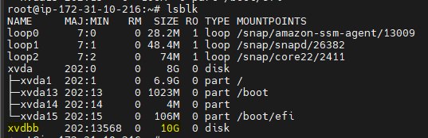

2) Create Partitions
```bash
fdisk /dev/xvdbb
```
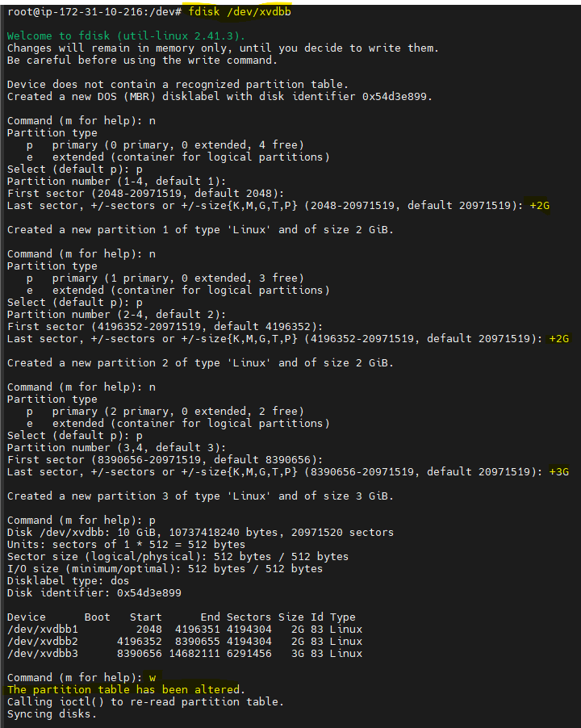

3) Now check the partition 
```bash
lsblk
```
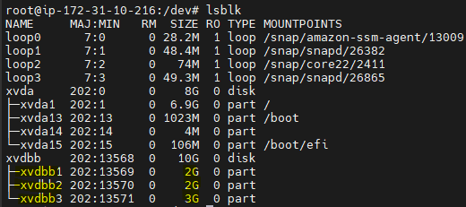

4) Create Filesystems
```bash
sudo mkfs.ext4 /dev/xvdbb1
sudo mkfs.ext4 /dev/xvdbb2
sudo mkfs.ext4 /dev/xvdbb3
```
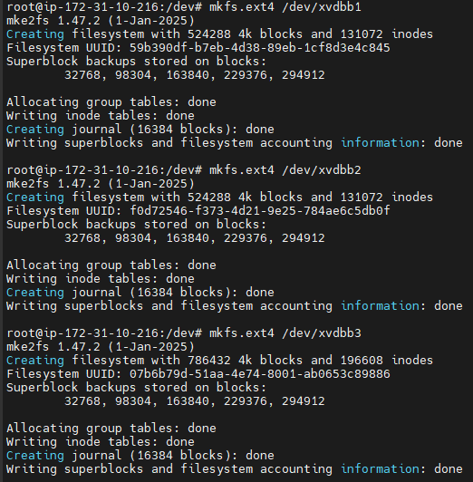

5) Create Mount Directories
```bash
sudo mkdir /mnt/data1
sudo mkdir /mnt/data2
sudo mkdir /mnt/data3
```

6) Mount Partitions
```bash
sudo mount /dev/xvdbb1 /mnt/data1
sudo mount /dev/xvdbb2 /mnt/data2
sudo mount /dev/xvdbb3 /mnt/data3
```

7) Verify mounts   

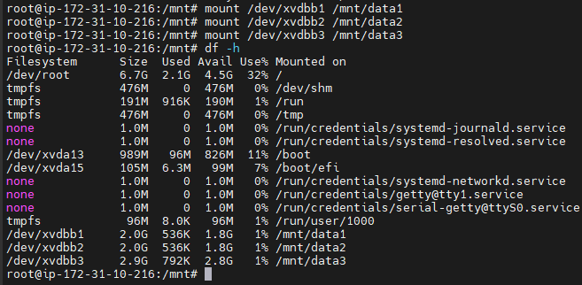

8) Permanent Mount 
```bash
blkid    # to get UUID
vim /etc/fstab
```

Add below text in fstab -
```text
UUID=<uuid1> /data1 ext4 defaults 0 0
UUID=<uuid2> /data2 ext4 defaults 0 0
UUID=<uuid3> /data3 ext4 defaults 0 0
```
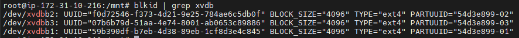


## Hard Link vs Soft Link

**Hard Link:**

* Direct pointer to file data
* Data remains even if original is deleted
* Example:

```bash
touch file.txt
ln file.txt hardlink.txt
```

**Soft Link (Symbolic Link):**

* Points to file path (shortcut)
* Broken if original file is deleted
* Can link directories and across filesystems
* Example:

```bash
ln -s file.txt symlink.txt
```

## Linux System Info Commands

| Command | Purpose                               |
| ------- | ------------------------------------- |
| top     | Check CPU usage and running processes |
| df -h   | Check storage usage                   |
| free -h | Check memory (RAM) usage              |


## DISK & PERFORMANCE DEBUGGING
- `du -sh *`  - Shows disk usage in human readable format for all files/directories in current path

| Command | Shows                           |
| ------- | ------------------------------- |
| `du`    | Space used by files/directories |
| `df`    | Filesystem free/used space      |

- Use `iostat -x 1` to detect disk saturation, latency, and queue buildup.
- Use `vmstat 1` for a quick health snapshot—CPU, memory pressure, swap, blocked processes, and I/O wait.
- Cheat sheet 
```bash
du -sh *         # who is using space
df -h            # filesystem capacity
df -i            # inode usage
iostat -x 1      # disk latency/utilization
vmstat 1         # CPU/memory/io wait
lsof | grep deleted
```
- A file descriptor (FD) is a small integer number used by the operating system to represent an open file or I/O resource for a process.

 > Scenario: How will you debug "Too many open files" issue.  
 -> If I see “Too many open files,” I first check `ulimit -n` and process FD usage with `lsof` or `/proc/<pid>/fd`. Then I determine whether it’s due to high connections, FD leak, or deleted files still held open. Immediate mitigation is restarting or increasing limits. Permanent fix is setting `LimitNOFILE`, updating OS limits, and resolving application leaks.


## SYSTEMD / SERVICES
SYSTEMD:  
- systemd is the init system and service manager in modern Linux that starts the OS userspace and manages background services throughout the system lifecycle.
- It is the first userspace process started by the kernel during boot and usually has PID 1.


What is a Service?  
- A service is a program/process that runs in the background to provide some functionality, usually without direct user interaction.
- Example: Docker daemon, Kubernetes kubelet
- How `systemd` manages services? 
  - Services are defined using unit files, usually ending in: `.service`
- Common commands 
```bash
systemctl status nginx
systemctl start nginx  # start now
systemctl stop nginx
systemctl restart nginx
systemctl enable nginx  # start automatically on boot
systemctl disable nginx
systemctl daemon-reload
journalctl -u nginx    # query and display logs from the systemd-journald service
```

Example Custom Service -  
```ini
[Unit]
Description=My Java App
After=network.target

[Service]
ExecStart=/usr/bin/java -jar /opt/app/app.jar
Restart=always
User=appuser

[Install]
WantedBy=multi-user.target
```

Where are service files stored?
- /etc/systemd/system
- /usr/lib/systemd/system

> Scenario: App is not starting after reboot, why?  
-> I’d first check if the service is enabled using `systemctl is-enabled`. Then inspect `systemctl status` and `journalctl -u service -b`. Most reboot failures are due to missing dependencies like network/database, missing environment variables, wrong permissions, wrong working directory, mounts not ready, or port conflicts. Then I’d fix the unit file and reload systemd.


## Logging 
- A system-wide log file - `/var/log/messages`
- Check live system logs - `tail -f /var/log/messages`
- Check logs for a specific service - `journalctl -u nginx`
```bash
journalctl -u nginx -f        # live logs
journalctl -u nginx -b        # logs since last boot
journalctl -u nginx --since "10 min ago"
journalctl -u nginx -n 50     # last 50 lines
journalctl -xe   # Show recent logs with detailed explanations (especially errors)
```


## Key Concepts

* Everything is treated as a file (including devices and processes)
* Linux is case-sensitive (File.txt ≠ file.txt)
* File permissions control access (read/write/execute)
* Mounting makes a filesystem accessible at a directory
* `/etc/passwd` stores user account info; one line per user
* `/etc/environment` stores environment variables (`VAR=value`), view with `env` or `printenv`


## Environment variables
- In Linux, environment variables are key-value pairs used by the shell and applications. eg. `JAVA_HOME`
- Add Environment Variable Temporarily (Current Session)
  - `export MY_VAR=hello`
  - `echo $MY_VAR`
  - This works only for the current shell session.
- Add Permanently for Current User
  - Step 1 - `vi ~/.bashrc`
  - Step 2 - add: `export MY_VAR=hello`
  - Step 3 - `source ~/.bashrc`
- Add Globally for All Users
  - add it in `/etc/profile` or create file like: `/etc/profile.d/custom.sh`
- Add Environment Variable for systemd Service
  - `systemctl edit myapp` or edit unit file: `/etc/systemd/system/myapp.service`
```ini
[Service]
Environment="JAVA_HOME=/usr/lib/jvm/java-17"
Environment="SPRING_PROFILES_ACTIVE=prod"
EnvironmentFile=/etc/myapp.env
```
  - Then run `systemctl daemon-reload` and `systemctl restart myapp`
  - Example `/etc/myapp.env` -
```bash
DB_HOST=db.internal
DB_PORT=5432
API_KEY=secretvalue
```
- Check existing variables using - `printenv`

**/etc/environment vs /etc/profile vs ~/.bashrc**
| File               | Scope       | Type         | Best For            |
| ------------------ | ----------- | ------------ | ------------------- |
| `/etc/environment` | All users   | simple vars  | global login env    |
| `/etc/profile`     | All users   | shell script | shell login config  |
| `~/.bashrc`        | Single user | shell script | user shell settings |
| systemd unit       | One service | service env  | app runtime         |

> Note:   
`.bash_profile` is read for login shells and is mainly used for environment setup like `PATH` or `JAVA_HOME`. `.bashrc` is read for interactive non-login shells and is better for aliases, prompt customization, and shell behavior. Commonly `.bash_profile` sources `.bashrc` so both are applied.

## Format of /etc/passwd
```
username:x:UID:GID:comment:home_directory:shell
```


# vim Editor shortcuts

| Shortcut / Command | Purpose                                  |
| ------------------ | ---------------------------------------- |
| `o`                | Open new line below cursor               |
| `O`                | Open new line above cursor               |
| `0`                | Move to beginning of line                |
| `$`                | Move to end of line                      |
| `gg`               | Go to top of file                        |
| `:10`              | Go to line 10                            |
| `yy`               | Copy (yank) current line                 |
| `p`                | Paste below cursor                       |
| `P`                | Paste above cursor                       |
| `5dd`              | Delete 5 lines                           |
| `x`                | Delete character under cursor            |
| `D`                | Delete from cursor to end of line        |
| `u`                | Undo last change                         |
| `Ctrl + r`         | Redo undone change                       |
| `/word`            | Search forward for “word”                |
| `?word`            | Search backward for “word”               |
| `n`                | Go to next search match                  |
| `N`                | Go to previous search match              |
| `:s/old/new/`      | Replace first occurrence in current line |
| `:%s/old/new/g`    | Replace all occurrences in file          |
| `:%s/old/new/gc`   | Replace all with confirmation            |
| `:set number`      | Show line numbers                        |
| `:set nonumber`    | Hide line numbers                        |
| `:noh`             | Remove search highlighting               |
| `ggVG`             | Select entire file                       |


## Practice Shell Script Questions

1. Check available free memory and alert if below threshold.
2. Automate creation of a new user with specific permissions and home directory.
3. Find all large files >1GB in a directory and move them to another directory.
4. Automatically update all installed packages and reboot if needed.
5. Count number of lines in all `.log` files in a directory.
6. Check for the presence of specific software (Docker, Git) and install if missing.