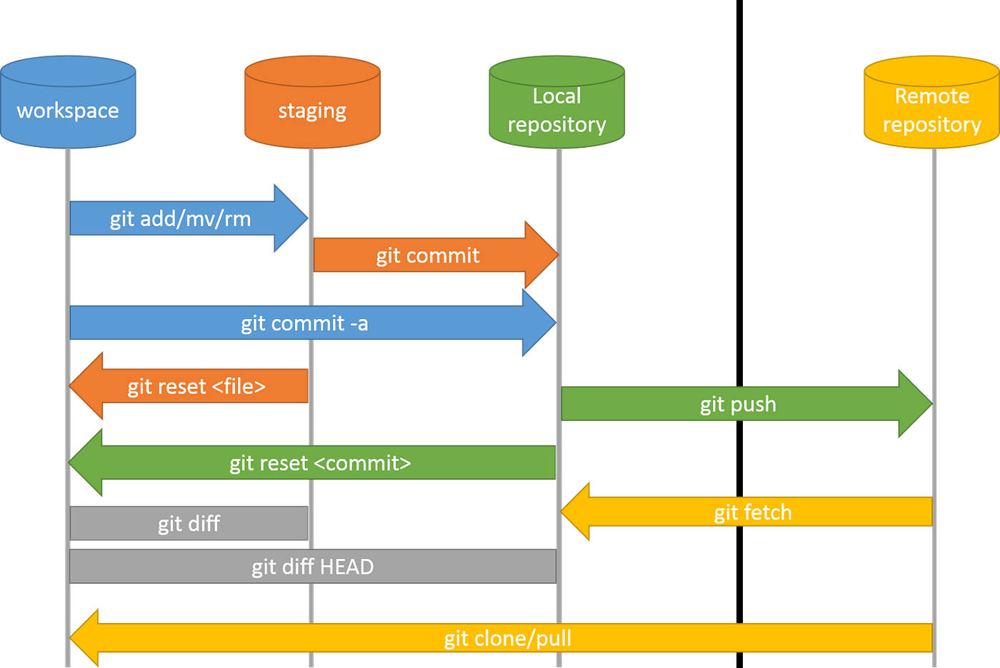

# Git & GitHub

---

## What is Version Control System (VCS)?

A Version Control System (VCS) is a tool or software that helps developers track, manage, and control changes to source code (or any files) over time.

> In simple words, a Version Control System is like a “time machine” for your code — it records every change made to your files so you can revisit or restore any previous version whenever needed.

### Types of Version Control Systems

**1. Centralized Version Control (CVCS)**
- A single central server stores all files and version history.
- Developers “check out” files and commit changes to the central repository.
- Example: Subversion (SVN), Perforce
- ⚠️ Problem: If the server goes down, everyone loses access.

**2. Distributed Version Control (DVCS)**
- Every developer has a full copy of the repository (including history).
- Developers can work offline and sync changes later.
- Examples: Git, Mercurial
- ✅ Most modern and reliable approach (used in DevOps, CI/CD).

---

## Git Architecture and Working Directory Lifecycle



---

## Git Configuration (`git config`)

Once installed, Git needs your identity and preferences — this is done using the `git config` command.

### Levels of Configuration

| Level   | Scope                        | Location         | Description                       |
|---------|-------------------------------|----------------|----------------------------------|
| System  | Applies to all users on system | `/etc/gitconfig` | System-wide settings             |
| Global  | Applies to current user       | `~/.gitconfig`  | Common for user identity         |
| Local   | Applies to specific repository | `.git/config`   | Overrides global settings        |

**Order Git reads settings:**  
`Local > Global > System`

**Set your name and email:**

```bash
git config --global user.name "Nancy Wheeler"
git config --global user.email "nancy@example.com"
```

**See all current settings:**

```bash
git config --list
```

**CI/CD automation (local config):**

```bash
git config --local user.name "CI Bot"
git config --local user.email "ci@company.com"
```

---

## Basic Git Commands

- **`git init`**  
  Creates a hidden `.git` folder in your project directory. Converts an untracked folder into a Git-managed repository.

- **`git clone <repository-url>`**  
  Downloads an existing repository (and its full history) from a remote source.  
  Equivalent to: `git init + git remote add origin + git fetch + git checkout`

- **`git log`**  
  Displays all previous commits in reverse chronological order.

- **`git diff`**  
  Shows line-by-line differences between:
  - Working directory and staging area
  - Two commits
  - Two branches

- **`git rm`**  
  Deletes files from the working directory and staging area.  
  Use `--cached` to untrack sensitive files accidentally committed (then add to `.gitignore`).

---

## Git Branching

### What is a Branch in Git?

A branch is a lightweight movable pointer to a commit.

- By default, every Git repo starts with a `main` (or `master`) branch.
- New branches start pointing to the same commit as the current branch.
- As you commit, the branch pointer moves independently.
- Think of branches like **parallel timelines** of your project.

### Branch Commands

| Command | Purpose |
|---------|---------|
| `git branch <branch-name>` | Create a new branch |
| `git branch` | View all branches |
| `git branch -D <branch-name>` | Force delete a branch |
| `git checkout <branch-name>` | Move working directory to another branch |
| `git checkout -b <branch-name>` | Create and switch to a branch in one step |
| `git switch -c <branch-name>` | Modern alternative to checkout for branch creation |

---

## Merge Types: Fast-Forward vs Three-Way Merge

### 1. Fast-Forward Merge

- Happens when the target branch has **not diverged**.
- Git moves the branch pointer forward; no extra commit is created.

```
(main) A --- B
               \
                C --- D (feature)

After merge:
A --- B --- C --- D (main, feature)
```

### 2. Three-Way Merge (Non-Fast-Forward Merge)

- Happens when branches have diverged.
- A **merge commit** is created.

```
       C --- D (feature)
      /
A --- B
      \
       E --- F (main)

After merge:
       C --- D
      /       \
A --- B ----- M (main)
      \
       E --- F
```

- Merge uses three commits: common ancestor, HEAD of main, and tip of merged branch.

---

## Git Rebase vs Git Merge

- **Merge:** Creates a merge commit, preserves history.
- **Rebase:** Reapplies commits on top of another branch, rewriting history for linear history.

**Example:**

```
main:    A --- B --- C
feature: A --- D --- E
```

- Merge:

```bash
git checkout feature
git merge main
```
- Merge commit created; history includes all commits.

- Rebase:

```bash
git checkout feature
git rebase main
```
- Commits D and E replayed on top of C; history looks linear.

---

## Git Cherry-Pick

- Apply a specific commit (or multiple commits) from one branch onto another.

```bash
git cherry-pick <commit-hash>
git cherry-pick <hash1> <hash2> <hash3>
```
What Happens Internally:
	• Git takes the diff (changes) introduced by the selected commit.
	• It applies those changes on top of your current branch.
Creates a new commit with the same message (and a new hash).

---

## Git Tagging

- **Lightweight Tag:** Simple pointer; no metadata.
- **Annotated Tag:** Full object with tagger info, date, and message.

```bash
git tag v1.0        # Create tag
git push origin v1.0 # Push tag explicitly
git tag             # List all tags
git checkout v1.0   # Move to tagged commit
```

---

## Git Fork

- A fork is a **copy of a repository** on your account.
- Used for collaborating on others’ projects without write access.

---

## Git Submodule

A Git submodule allows you to include one Git repository inside another as a subdirectory.

* Think of it as embedding a repository within another repository.
* The parent repo keeps a pointer to a specific commit of the submodule.
* Submodules are often used for:

  * Shared libraries
  * Vendor code
  * Microservices or multi-repo projects

**Analogy:**

* Parent repo = “Main project”
* Submodule = “Library project” inside a folder of the main project
* The parent repo remembers the exact version of the library it depends on.

**Add a submodule:**

```bash
git submodule add <repository-url> <path>
```

**Example:**

```bash
git submodule add https://github.com/example/utils.git libs/utils
```

* Adds the `utils` repo inside `libs/utils` folder in your project.
* Creates a `.gitmodules` file in the parent repo to track submodules.
* Submodules lock to a specific commit — you must explicitly update them.
* `git pull` in the parent repo does not automatically update submodules; use:

```bash
git submodule update --remote
```

> A Git submodule is a repository inside another repository, allowing you to manage dependencies or libraries while keeping them version-controlled and independent.


---

## Git LFS (Large File Storage)

- Stores large files as lightweight pointers in Git.
- Actual files stored in remote Git LFS storage.
- Keeps repositories fast and manageable.

How Git LFS Works
	1. You track files using Git LFS (e.g., images, videos).
	2. Git replaces the file in commits with a pointer file (small text file).
	3. Actual file content is stored in remote Git LFS storage.
  4. When cloning/pulling, Git LFS fetches the actual file contents automatically.


---

## Git Hooks

- Scripts executed automatically at Git events (commit, push, receive).
- Stored in `.git/hooks/`.
- Example: Abort commit if staged files contain TODOs:

```bash
#!/bin/sh
if git diff --cached | grep -i "TODO"; then
  echo "You have TODO comments in staged changes. Commit aborted."
  exit 1
fi
exit 0
```

> Hooks are local and not pushed; share via repo folder or template scripts.

---

## The `.git` Directory

- Hidden folder storing all metadata and objects.
- Contains commits, branches, configuration, hooks, etc.
- Git cannot track changes without `.git`.

---

## Git Reflog & fsck

| Command      | Purpose                          | Use Case                          | Scope          |
|-------------|---------------------------------|----------------------------------|----------------|
| `git reflog` | Tracks HEAD movements            | Recover lost commits, undo mistakes | Local only    |
| `git fsck`   | Verifies repository integrity    | Detect corruption, dangling objects | Entire repo   |

---

## Git Reset


- **Soft:** `git reset --soft <commit>` → HEAD moves, changes staged.
- **Mixed:** `git reset <commit>` → HEAD moves, changes unstaged.
- **Hard:** `git reset --hard <commit>` → HEAD moves, changes discarded.

---

## Git Revert

- Creates a **new commit that undoes a previous commit**.

```bash
git revert <commit>
```

---

### Git Checkout (partially replaced by `git restore`)

* Restore working directory changes:

```bash
git restore file.txt
```

* Restore from a specific commit:

```bash
git restore --source HEAD~1 file.txt
```

* Restore staged changes (unstage):

```bash
git restore --staged file.txt
```

**Tips:**

* Use `reset` for local undo (rewrites history).
* Use `revert` for safe undo on shared branches.
* Use `restore` instead of `checkout` to avoid accidental branch switching.

---

### Partial Staging (`git add -p`)

Partial staging allows you to selectively stage only parts of a file (specific lines or hunks) instead of the entire file.

```bash
git add -p <file>
```

**Example:**

* Suppose `app.py` has 10 lines changed, but you want to commit only some of them.
* Git will display each “hunk” (block of changes) one by one:

```
diff --git a/app.py b/app.py
@@ -10,6 +10,9 @@
- old line
+ new line
Stage this hunk [y,n,q,a,d,e,?]?
```

**Options:**

| Option | Meaning                                             |
| ------ | --------------------------------------------------- |
| y      | Stage this hunk                                     |
| n      | Do not stage this hunk                              |
| q      | Quit; do not stage this hunk or any remaining hunks |
| a      | Stage this hunk and all remaining hunks             |
| d      | Do not stage this hunk or any remaining hunks       |
| e      | Edit the hunk manually (very fine control)          |
| s      | Split the hunk into smaller pieces                  |
| ?      | Show help                                           |

**Complete Flow:**

```bash
git status  # Check status
git add -p app.py  # Stage only the parts you want using y/n for each hunk
git commit -m "Commit only specific changes"  # Commit staged changes
```
